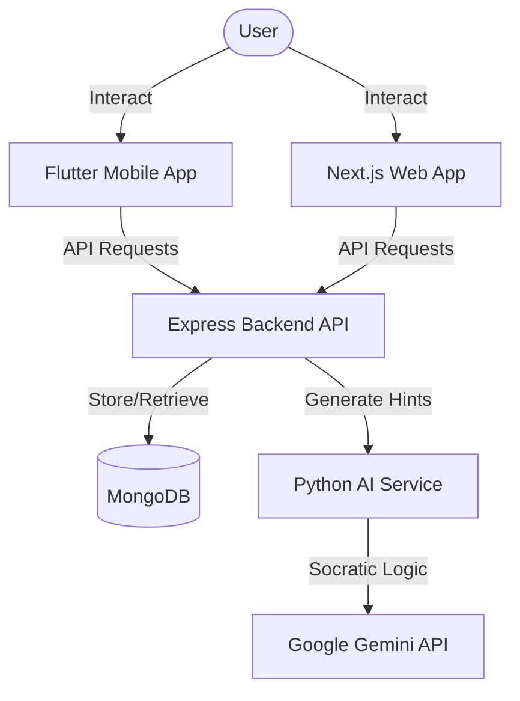
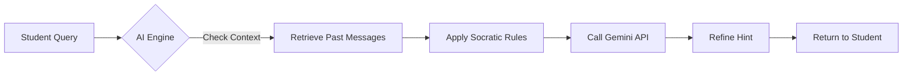
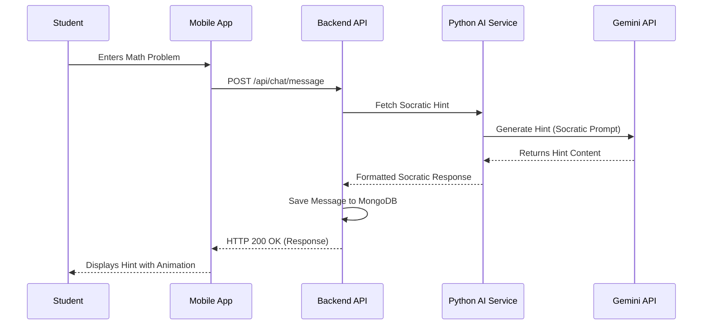

# Socratic AI: Final Project Report

## 3.5 Objectives
The primary goal of Socratic AI is to revolutionize the learning experience by moving away from rote answer-providing and toward critical thinking through the Socratic method.

### 3.5.1 Functional Objectives
- **Account Management**: Students and educators should be able to create accounts and log in securely.
- **Persistent Knowledge Base**: User profiles, session histories, and course-specific metadata must be stored in a centralized MongoDB database.
- **24/7 Availability**: The application should be globally accessible via web and mobile interfaces at all times.
- **Socratic Interaction Flow**: The AI must analyze student queries and respond with guiding questions or hints instead of direct answers.
- **Auto-Reveal Logic**: After a set number of failed attempts or guided hints (e.g., 3-5), the system should optionally reveal the solution to prevent student frustration.
- **Subject Specialization**: The system must support categorization of queries into subjects like Math, Physics, Chemistry, and Biology, providing context-aware guidance.
- **Admin Supervision**: Administrators should be able to view session analytics and manage user account statuses.
- **Real-time Synchronization**: Updates to student sessions must be reflected across both web and mobile platforms instantly.

### 3.5.2 Non-Functional Objectives
- **Scalability**: The backend must handle concurrent tutoring sessions using stateless API architecture.
- **Low Latency**: AI-generated hints should be delivered within seconds to maintain the flow of conversation.
- **Privacy**: Student data and interaction logs must be encrypted and accessible only to authorized users.
- **User Experience (UX)**: The interface must be "Premium" and "Dynamic," featuring smooth transitions and modern typography to keep students engaged.

## 3.8 Requirement Analysis
### 3.8.1 SRS Preparation
The Software Requirements Specification (SRS) for Socratic AI was developed through collaborative research on pedagogical best practices. We focused on bridging the gap between automated AI responses and effective teaching methods.

### 3.8.2 Product Portfolio
The Socratic AI ecosystem consists of:
1.  **Mobile App (Flutter)**: A cross-platform mobile application for learning on the go.
2.  **Web Dashboard (Next.js)**: A comprehensive platform for desktop-based study and analytics.
3.  **Backend API (Express/Node.js)**: The central hub managing data persistence and security.
4.  **AI Engine (Python/FastAPI)**: A specialized service that enforces Socratic constraints on the Gemini LLM.

### 3.8.3 Actors
- **Student**: The primary user who asks questions and engages in the Socratic dialogue.
- **Educator/Admin**: Manages course content and monitors student progress.
- **AI Tutoring Engine**: The system actor that processes input and generates hints.

## 3.9 Software Technologies Used for Development
1.  **Flutter**: Used for the mobile application to ensure a high-performance, natively compiled experience for both iOS and Android from a single codebase.
2.  **Next.js**: Powering the web interface with server-side rendering and a modern React-based architecture for a fast, SEO-friendly experience.
3.  **Node.js & Express**: The foundation of the backend API, providing a scalable and lightweight runtime for handling requests.
4.  **MongoDB**: A NoSQL, document-oriented database used for its flexibility in storing complex session histories and user metadata.
5.  **Python & FastAPI**: Used to build the AI microservice, enabling high-performance integration with Gemini AI and complex logic for prompt engineering.
6.  **Gemini Pro API**: The underlying Large Language Model that powers the intelligence of the tutor.

## 4.0 System Design
The design phase translates our functional requirements into a technical blueprint.

### 4.1 System Architecture
The system follows a microservices-inspired monorepo architecture for modularity and ease of deployment.



### 4.2 AI Tutoring Pipeline
The core logic resides in the interaction between the student and the AI engine.



## 4.3 Sequence Diagram
This diagram illustrates the message flow during a typical tutoring interaction.



## 4.4 Database Design
### 4.4.1 Database Schema
We use Mongoose to define the structure of our data models. Below are the primary schemas:

**User Schema (`User.ts`)**
```javascript
const userSchema = new Schema({
    name: { type: String, required: true },
    email: { type: String, required: true, unique: true },
    password: { type: String, required: true },
    streak: { type: Number, default: 0 },
    subjects: { type: [String], default: ['math', 'physics', 'chemistry', 'biology'] },
    notificationsEnabled: { type: Boolean, default: true }
}, { timestamps: true });
```

**Session Schema (`Session.ts`)**
```javascript
const sessionSchema = new Schema({
    userId: { type: Schema.Types.ObjectId, ref: 'User' },
    subject: { type: String, required: true },
    messages: [{
        role: { type: String, enum: ['user', 'assistant'] },
        content: { type: String },
        timestamp: { type: Date, default: Date.now }
    }],
    attemptCount: { type: Number, default: 0 },
    isCompleted: { type: Boolean, default: false }
}, { timestamps: true });
```

## 4.5 User Interface Design
User interface (UI) design for Socratic AI involves crafting visually appealing and user-friendly interfaces that prioritize a "premium" educational experience. Our design philosophy centers on an intuitive and efficient user journey, ensuring that students can focus entirely on the learning process without technical friction.

### 4.5.1 Design Principles
Effective UI design in our project prioritizes:
- **Consistency**: Uniform use of colors, typography, and spacing across web and mobile platforms.
- **Clarity**: High-contrast text and clear iconography to ensure readability during intense study sessions.
- **Simplicity**: Minimalist layouts that reduce cognitive load, allowing the Socratic dialogue to remain the focal point.
- **Visual Excellence**: Use of glassmorphism, vibrant gradients, and micro-animations to create a modern, engaging atmosphere.

### 4.5.2 Design Tools
To achieve this level of sophistication, we leverage industry-leading design tools:
- **Figma**: Our primary tool for collaborative prototyping and interface design. Figma allows our team to iterate in real-time, creating high-fidelity wireframes that directly inform our Flutter and Next.js implementations.
- **Photoshop**: Used for creating detailed custom graphics, glowing assets, and refining image-based UI elements.
- **Corel DRAW**: Employed for precise vector illustrations, including custom subject icons and branding assets that require perfect scalability.

### 4.5.3 UI Mockups and Screenshots
The following screenshots demonstrate the result of our design process across different platforms and modules.

**Mobile Chat Interface**

*Figure 1: The Socratic Chat interface featuring glassmorphic bubbles and the interactive 'Reveal' hint system.*

**Web Analytics Dashboard**

*Figure 2: The centralized web dashboard showing subject cards, learning progress, and weekly activity charts.*

**Subject Selection Flow**

*Figure 3: A sleek, high-contrast subject selection screen designed for rapid navigation and continuity.*
